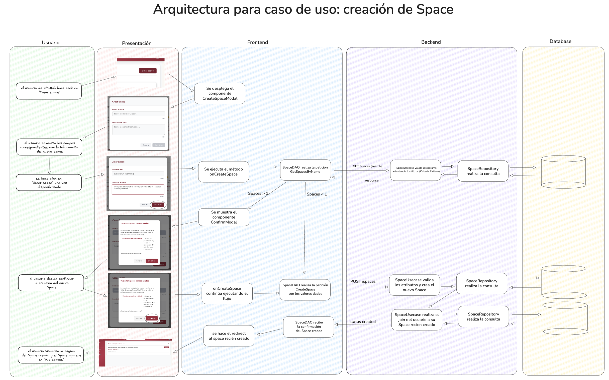

# Entrega 1

## 🎯 Objetivos de la Iteración
En esta primera entrega, nos enfocamos principalmente en la experiencia del usuario al interactura con la plataforma CPIHub; esto incluye desde su logeo, navegación, interacción en los primeros Spaces y sentido de pertenencia a la plataforma: un lugar donde todos podemos participar y sentirse parte de la comunidad.

---

## Diagrama de Clases

El modelo de datos incluye las entidades principales y sus relaciones para soportar la funcionalidad de esta primera verisón.

---

## Casos de uso

Funcionalidades alcanzadas y que actualmente el usuario de CPIHub va a poder hacer. 

## Arquitectura del Sistema

Dibujamos cómo es nuestra arquitectura principal y cómo se dividen las responsabilidades para el caso de uso de creación de un Space. 

---

_CPIHub - Entrega 1 | Octubre 2025_

