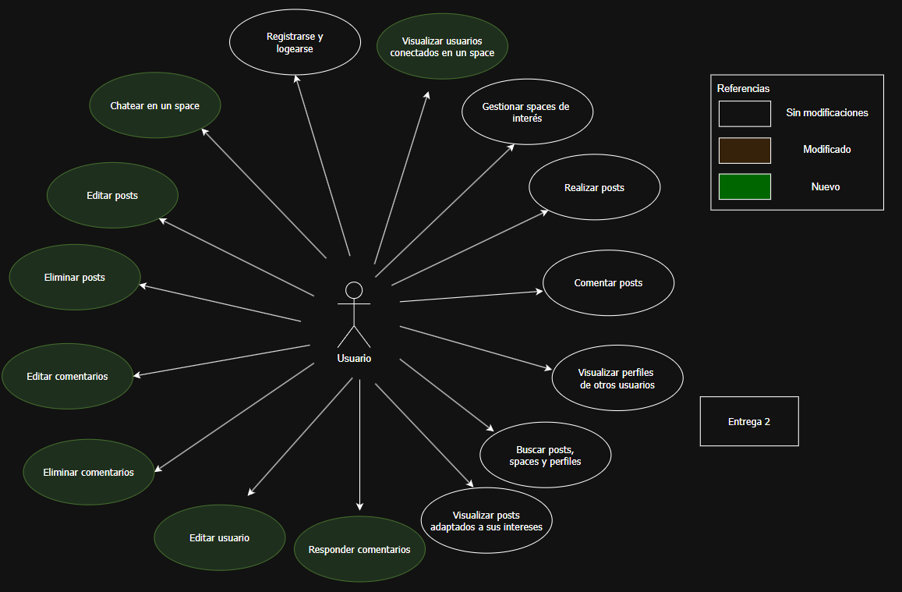

# ENTREGA 2

## 🎯 Objetivos de la iteración
En esta segunda entrega, nos centramos en expandir las funcionalidad de la plataforma CPIHub, dandole prioridad entre las relaciónes de los usuarios con la generación de chats de textos, visualización de estado de conexión y la posibilidad de responder comentarios, fomentando así una comunicación más dinámica y fluida entre los miembros de la comunidad. Ademas de agregar caracteristicas escenciales como la edición de perfiles, posteos y comentarios, puntos claves que mejoran la experiencia del usuario y su interacción dentro de la plataforma. Como agregado, seguimos trabajando en la mejora de la interfaz y experiencia del usuario para hacerla más intuitiva y atractiva.

## 🧩 Nuevas funcionalidades

### 🗨️ Chatear en un space  
- El usuario accede al chat de un space de interés.  
- El sistema muestra el historial reciente de mensajes del chat correspondiente.  
- El usuario puede escribir y enviar nuevos mensajes.  
- El sistema actualiza el chat en tiempo real, mostrando los mensajes enviados por todos los usuarios conectados a este.  

---

### 👥 Visualizar usuarios conectados en un space  
- El usuario ingresa a un space.  
- El sistema muestra una lista de todos los usuarios del space, resaltando aquellos que están actualmente conectados en ese espacio.  
- La lista se actualiza dinámicamente a medida que otros usuarios se conectan o desconectan.  
- El usuario puede identificar fácilmente quiénes están disponibles para chatear o interactuar.  

---

### ✏️ Editar posts  
- El usuario selecciona uno de sus posts existentes.  
- El sistema carga el contenido actual del post en modo de edición.  
- El usuario elige editar el post.  
- Al confirmar los cambios, el sistema actualiza la publicación.  

---

### 🗑️ Eliminar posts  
- El usuario selecciona uno de sus posts.  
- El sistema muestra un mensaje de confirmación para evitar eliminaciones accidentales.  
- Si el usuario confirma, el sistema elimina el post de su perfil y del feed general.  
- El contenido deja de estar visible para otros usuarios.  

---

### 💬 Editar comentarios  
- El usuario selecciona uno de sus comentarios.  
- El sistema abre el comentario en modo de edición.  
- El usuario modifica el texto y confirma los cambios.  
- El sistema actualiza el comentario editado, mostrando la nueva versión de forma visible para los demás usuarios.  

---

### 🗑️ Eliminar comentarios  
- El usuario elige uno de sus comentarios para eliminar.  
- El sistema solicita confirmación antes de proceder.  
- Al aceptar, el sistema elimina el comentario del post correspondiente.  
- El comentario deja de ser visible para todos los usuarios.  

---

### ✏️ Editar usuario  
- El usuario accede a la configuración de su cuenta.  
- El sistema muestra el formulario de edición con los datos actuales del usuario.  
- El usuario realiza los cambios deseados y confirma la edición.  
- El sistema actualiza la información del perfil y muestra un mensaje de éxito.  

---

### 💭 Responder comentarios  
- El usuario visualiza un post con comentarios.  
- Selecciona un comentario para responder.  
- El sistema habilita un campo de texto vinculado al comentario original.  
- El usuario escribe y envía su respuesta.  
- El sistema publica la respuesta de forma anidada, mostrando la relación entre comentario y respuesta.  
