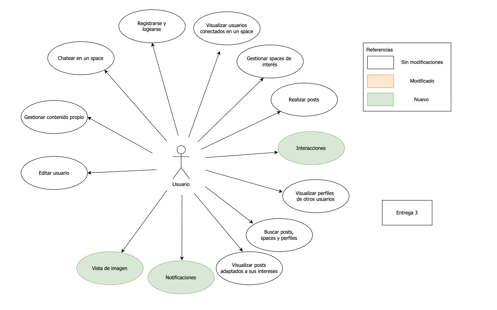

# ENTREGA 3

## 🎯 Objetivos de la iteración

En esta tercera entrega, el objetivo principal fue mejorar la interacción entre los usuarios dentro de la plataforma **CPIHub**, incorporando mecanismos que fomentan una comunicación más dinámica y retroalimentada.  
Para ello, se implementaron las funcionalidades de **likes y dislikes** en posts y comentarios, permitiendo expresar reacciones de manera rápida y sencilla.  
Además, se introdujo un **sistema de notificaciones**, el cual informa al usuario cuando alguien interactúa con su contenido, ya sea a través de reacciones o respuestas.  
Estas mejoras fortalecen la participación y la conexión entre los usuarios, otorgándole a la plataforma una experiencia más social y activa.

## 🧩 Funcionalidades de la entrega

## 📋 Descripción de las funcionalidades modificadas

### 👍 Interacciones con posts

- El usuario puede **dar like o dislike** a los posts publicados por otros usuarios.  
- El sistema **registra la reacción** y actualiza el conteo total de likes y dislikes en tiempo real.  
- Si el usuario cambia su reacción, el sistema actualiza la información en consecuencia.  
- El autor del post recibe una **notificación** indicando que otro usuario ha reaccionado a su publicación.  
- Se mantiene la posibilidad de realizar y visualizar comentarios en los posts.  

---

### 💬 Interacciones con comentarios

- El usuario puede **reaccionar (like/dislike)** a los comentarios realizados por otros usuarios.  
- El sistema actualiza el conteo de reacciones en tiempo real, mostrando los cambios a todos los usuarios.  
- Si alguien responde al comentario, el autor recibe una **notificación** avisándole de la nueva interacción.  
- Se conserva la posibilidad de responder comentarios de forma anidada, manteniendo la jerarquía visual entre comentarios y respuestas.  

---

## 🔔 Sistema de notificaciones

- El sistema genera notificaciones automáticas en los siguientes casos:  
  - Cuando un usuario **da like o dislike** a un post o comentario propio.  
  - Cuando un usuario **responde** a un post o comentario propio.  
- Las notificaciones aparecen en una sección dedicada del perfil del usuario.  
- Cada notificación indica el tipo de interacción, el usuario que la realizó y el contenido afectado.  
- El sistema marca las notificaciones como leídas una vez que el usuario las visualiza.  

---

## 🧱 Resumen de cambios

| Tipo de cambio | Caso de uso | Descripción |
|----------------|--------------|-------------|
| 🟤 Modificado | Interacciones con posts | Se agregaron reacciones (likes/dislikes) y notificaciones al autor. |
| 🟤 Modificado | Interacciones con comentarios | Se agregaron reacciones (likes/dislikes) y notificaciones por respuestas y reacciones. |
| ⚙️ Nueva funcionalidad transversal | Sistema de notificaciones | Permite informar al usuario sobre interacciones relevantes. |

---
