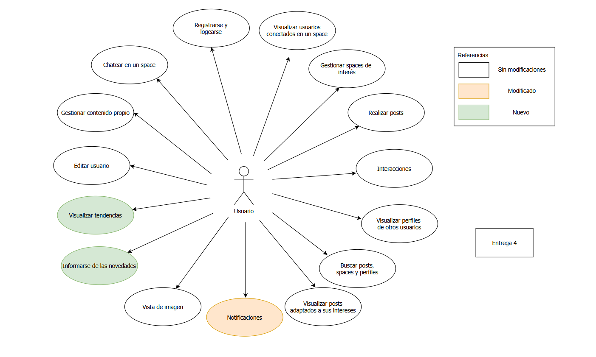

# ENTREGA 4

## 🎯 Objetivos de la iteración
En esta cuarta y última entrega, buscamos completar la experiencia general del usuario dentro de **CPIHub**, incorporando nuevas herramientas de información y mejorando mecanismos ya existentes.  

Se agregaron dos nuevas funcionalidades clave:  
- La visualización de **tendencias**, que permite conocer la actividad destacada de la comunidad.  
- La sección de **novedades**, pensada para informar a los usuarios desde la pantalla principal.  

Además, se ampliaron las capacidades del sistema de **notificaciones**, agregando nuevos tipos de avisos y permitiendo la redirección directa al contenido asociado.  

Con estos cambios, la plataforma se vuelve más dinámica, informativa y orientada a mantener a los usuarios al tanto de todo lo que ocurre.

---

## 🧩 Funcionalidades de la entrega

---

## 📋 Descripción de las funcionalidades nuevas

### 📈 Visualizar tendencias  
- El usuario accede a la sección de tendencias desde la sidebar.  
- El sistema procesa y muestra los posts, comentarios o usuarios con mayor participación.  
- El usuario puede seleccionar un filtro de tiempo (últimas 24hs, semana, mes o todo el tiempo).  
- El sistema actualiza la vista según el filtro elegido.  
- El usuario puede seleccionar un elemento destacado para visualizar el contenido completo (post, comentario o perfil).  

---

### 📰 Informarse de las novedades  
- El usuario ingresa al home de la plataforma.  
- El sistema muestra un carrusel con las novedades cargadas por el equipo directivo.  
- El usuario navega entre las diferentes novedades del carrusel.  
- El sistema presenta información relevante como título, descripción y contenido adicional.  
- El usuario puede acceder a la información completa si la novedad contiene enlaces o materiales complementarios.  

---

## 📋 Descripción de las funcionalidades modificadas

### 🔔 Notificaciones  
- El sistema genera notificaciones cuando un usuario comenta un post propio.  
- El sistema genera notificaciones cuando un usuario responde un comentario propio.  
- El sistema continúa generando notificaciones por reacciones (likes/dislikes) a posts y comentarios.  
- El usuario accede a la sección de notificaciones.  
- El sistema muestra la lista de notificaciones ordenadas cronológicamente.  
- Cada notificación incluye ahora una URL.  
- El usuario selecciona una notificación.  
- El sistema redirige al contenido correspondiente. 
- Cuando el usuario visualiza el contenido, el sistema marca la notificación como leída.  

---

## 🧱 Resumen de cambios
| Tipo de cambio | Caso de uso | Descripción |
|----------------|--------------|-------------|
| 🟩 Nuevo | Visualizar tendencias | Nueva sección que muestra posts, comentarios y usuarios destacados. |
| 🟩 Nuevo | Informarse de las novedades | Carrusel en el home con información importante para los usuarios. |
| 🟧 Modificado | Notificaciones | Nuevos tipos de avisos y redirección directa al contenido asociado. |

---

## 💡 Conclusión  
Con la incorporación de tendencias, novedades y un sistema de notificaciones más completo, CPIHub finaliza su desarrollo con una experiencia mucho más rica y conectada.  
Los usuarios pueden informarse mejor, acceder rápidamente a contenido relevante y mantenerse al tanto de toda la actividad de la comunidad.
